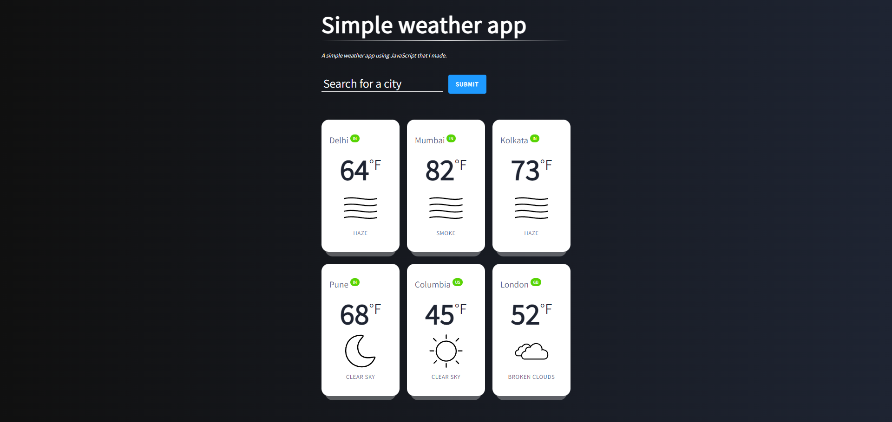

# Weather Web App

<!-- START doctoc generated TOC please keep comment here to allow auto update -->
<!-- DON'T EDIT THIS SECTION, INSTEAD RE-RUN doctoc TO UPDATE -->
## Table of Contents

- [Introduction](#introduction)
- [Features](#features)
- [Feedback](#feedback)

<!-- END doctoc generated TOC please keep comment here to allow auto update -->

## Introduction

View repository and user information, control your notifications and even manage your issues and pull requests.

## Features

A few of the things you can do with Weather Web App:

* View your and other cities Weather live.

  

## Feedback

Feel free to send us feedback on [Linkedin](https://www.linkedin.com/in/hariomtomar/) or [file an issue](https://github.com/harrybhai123/weather/issues/new). Feature requests are always welcome. If you wish to contribute.

